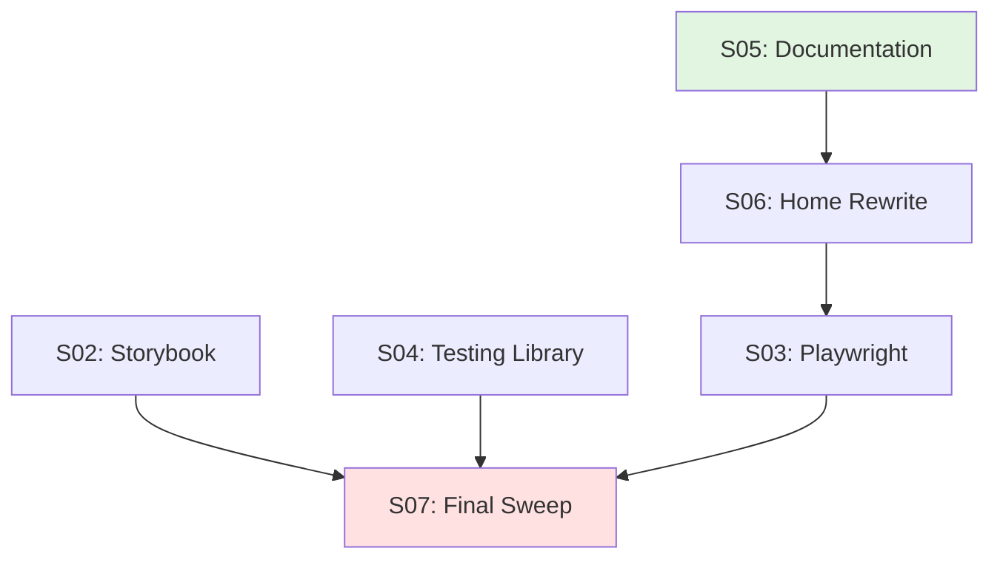

# Frontend Testing & Documentation Migration Strategy

**Milestone:** M002 - Frontend Architecture Alignment  
**Source:** S01 Audit Report  
**Date:** 2026-04-08  

---

## Executive Summary

This migration strategy provides the detailed execution roadmap for slices S02-S07 based on the formal frontend audit. The audit revealed a production-ready foundation with three primary gaps: Storybook (0/5 stories), Playwright (0/2 tests), and Testing Library integration coverage (1 hook test, 0 component tests).

**Total work:** 6 slices across 4 work clusters  
**Estimated complexity:** Low-medium (additive work, no breaking changes)  
**Critical path:** S05 → S06 → S03 → S07  
**Parallelizable:** S02 ∥ S04 can run with S05  

---

## S02: Storybook Setup + Core Stories

### Goal
Configure Storybook for Vite + React 19 and create 5 core component stories demonstrating shadcn/ui patterns in light/dark themes.

### Scope

**Configuration files to create:**
1. `.storybook/main.ts` — Storybook config for Vite + React
   - Framework: `@storybook/react-vite`
   - Addons: essentials, interactions, a11y
   - Story location: `../src/**/*.stories.tsx`
   - Vite alias resolution: `@/presentation`, `@/application`, etc.

2. `.storybook/preview.tsx` — Global decorators
   - ThemeProvider wrapper (light/dark toggle)
   - Tailwind CSS import
   - Global parameters (backgrounds, viewport)

**Story files to create:**
1. `src/presentation/components/ui/button.stories.tsx`
   - All variants: default, secondary, outline, ghost, destructive, link
   - All sizes: default, sm, lg, icon
   - States: enabled, disabled, loading (if applicable)

2. `src/presentation/components/ui/card.stories.tsx`
   - Basic card
   - Card with header
   - Card with header + footer
   - Card with description

3. `src/presentation/components/ui/input.stories.tsx`
   - Text input
   - Email input
   - Password input
   - With label
   - With error state
   - Disabled state

4. `src/presentation/components/ui/select.stories.tsx`
   - Basic select with options
   - With placeholder
   - With error state
   - Disabled state

5. `src/presentation/components/ui/dialog.stories.tsx`
   - Basic dialog (open/close)
   - Dialog with form inside
   - Alert dialog pattern

### Dependencies
- None (can run in parallel with S04)

### Verification
```bash
# Start Storybook
bun run storybook

# Expected:
# - Storybook launches on http://localhost:6006
# - All 5 stories visible in sidebar
# - No console errors
# - Theme toggle works (light/dark mode switch)
# - All story variants render correctly
```

### Files Modified
- `package.json.jinja` — Verify Storybook dependencies are active (conditional or unconditional)
- `vite.config.ts` — May need Storybook plugin config

### Risk Assessment
**Risk:** Low  
**Rationale:** Storybook 9 + Vite integration is well-documented. shadcn components are Storybook-friendly (no complex context dependencies).

---

## S03: Playwright Setup + Visual Regression Tests

### Goal
Configure Playwright for E2E testing and create 2 visual regression tests with baseline screenshots stored in Git.

### Scope

**Configuration file to create:**
1. `playwright.config.ts` — Playwright config
   - Base URL: `http://localhost:5173`
   - Browsers: chromium, firefox (webkit optional)
   - Screenshot storage: `tests/e2e/screenshots/`
   - Viewport: desktop (1280x720) and mobile (375x667)
   - Retries: 1 (for CI flakiness)

**Test files to create:**
1. `tests/e2e/home.spec.ts` — Home page visual regression
   - Navigate to `/`
   - Wait for page load (await network idle)
   - Take full-page screenshot
   - Compare against baseline
   - Test light and dark themes

2. `tests/e2e/forms.spec.ts` — Forms page validation + screenshot
   - Navigate to `/forms`
   - Fill contact form with valid data
   - Submit form
   - Verify success message displayed
   - Take screenshot of success state
   - Test validation error states (screenshot error state)

**Baseline storage strategy:**
- Store baselines in `tests/e2e/screenshots/baseline/`
- Commit baselines to Git (small PNGs ~10-50KB each)
- Ignore `tests/e2e/screenshots/actual/` and `tests/e2e/screenshots/diff/` (generated on failure for debugging)

**Gitignore additions:**
```
tests/e2e/screenshots/actual/
tests/e2e/screenshots/diff/
playwright-report/
test-results/
```

### Dependencies
- **S06 (Home page rewrite)** — Wait for S06 to complete before generating baselines to avoid baseline churn when Home page is simplified

### Verification
```bash
# Start dev server
bun run dev

# Run Playwright tests (in new terminal)
bun run test:e2e

# Expected:
# - All tests pass
# - Baselines generated in tests/e2e/screenshots/baseline/
# - No visual diffs detected
# - HTML report generated at playwright-report/index.html
```

### Files Modified
- `package.json.jinja` — Verify Playwright dependency active
- `.gitignore` — Add Playwright artifact paths

### Risk Assessment
**Risk:** Medium  
**Rationale:** Baseline management requires discipline. If component styling changes intentionally, baselines must be updated and committed. Risk of false positives (flaky visual diffs due to rendering differences across environments).

**Mitigation:** Use `threshold` parameter in Playwright screenshot comparison (e.g., `threshold: 0.2` allows 20% pixel difference). Document baseline update workflow in README.

---

## S04: Testing Library Integration Tests

### Goal
Create comprehensive integration test for Forms.tsx contact form demonstrating full submission flow with validation.

### Scope

**Test file to create:**
1. `tests/integration/forms/contact-form.test.tsx`

**Test coverage:**
- **Setup:** Render Forms component with Testing Library
- **Invalid submission:**
  - Fill name with 1 character (violates min length)
  - Fill email with invalid format
  - Fill message with 5 characters (violates min length)
  - Submit form
  - Verify 3 error messages displayed
- **Valid submission:**
  - Fill name with valid value (3+ chars)
  - Fill email with valid format
  - Fill message with valid value (10+ chars)
  - Submit form
  - Verify success payload displayed (JSON preview)
- **Reset:**
  - Click reset button
  - Verify all fields cleared

**Testing patterns used:**
- `render()` from `@testing-library/react`
- `screen.getByRole()`, `screen.getByLabelText()` for accessible queries
- `userEvent.type()`, `userEvent.click()` for interactions
- `waitFor()` for async validation
- `expect().toBeInTheDocument()`, `expect().toHaveValue()` for assertions

### Dependencies
- None (can run in parallel with S02)

### Verification
```bash
# Run Vitest
bun run test

# Expected:
# - Integration test passes
# - Coverage report shows Forms.tsx has integration coverage
# - No console errors or warnings
```

### Files Created
- `tests/integration/forms/` directory
- `tests/integration/forms/contact-form.test.tsx`

### Risk Assessment
**Risk:** Low  
**Rationale:** Testing Library + Vitest already configured. React Hook Form testing patterns well-documented. Forms.tsx has clear validation logic.

---

## S05: Documentation Clarity Updates

### Goal
Clarify AI guidance to prevent TanStack Query vs Form confusion and add explicit React Hook Form preference.

### Scope

**File 1: `.github/skills/shadcn-frontend/SKILL.md`**

**Change:** Add explicit prohibition section after React Hook Form guidance:

```markdown
### Form Library: React Hook Form Only

**Never use TanStack Form.** Use React Hook Form + Zod for all form validation.

**Clarification:**
- **TanStack Query** = Server state management (fetching, caching, synchronization)
- **TanStack Form** = Form state management (DEPRECATED in this template)
- **React Hook Form** = Our chosen form library (production-ready patterns in Forms.tsx and Settings.tsx)

When you see "TanStack" in documentation, always verify whether it refers to Query (allowed) or Form (forbidden).
```

**File 2: `.github/instructions/frontend.instructions.md`**

**Change:** Rewrite line 13 for clarity:

**Current:**
```markdown
- React: TanStack Query for server state, React Router for navigation, ErrorBoundary + Suspense for loading/error states, React Hook Form + Zod for form validation
```

**Updated:**
```markdown
- React Hook Form + Zod for form validation and schemas
- TanStack Query for server state fetching and caching
- React Router for navigation (prefer NavLink for primary nav)
- ErrorBoundary + Suspense for loading/error states
```

**Rationale:** Separate TanStack Query from form discussion to avoid proximity confusion.

### Dependencies
- None (can run immediately)

### Verification
```bash
# Verify explicit guidance added
grep -q "Never use TanStack Form" template/.github/skills/shadcn-frontend/SKILL.md

# Verify no confusing proximity
! rg "TanStack.*Form" template/.github/instructions/frontend.instructions.md -i

# Expected: Both commands succeed (first finds match, second finds no match)
```

### Files Modified
- `.github/skills/shadcn-frontend/SKILL.md`
- `.github/instructions/frontend.instructions.md`

### Risk Assessment
**Risk:** Trivial  
**Rationale:** Documentation-only changes. No code modifications.

---

## S06: Home Page Simplification

### Goal
Rewrite Home.tsx as minimal showcase of navigation + theme toggle, removing marketing content.

### Scope

**File to modify:** `src/presentation/pages/Home.tsx`

**Current content (remove):**
- 3 feature cards (Type-Safe, Accessible, Themeable)
- External shadcn docs link
- Marketing copy ("Production-ready")

**New content (keep/add):**
- Hero heading: "Frontend Starter Template"
- Description: "Clean Architecture + shadcn/ui + React Router + React Hook Form"
- Navigation showcase: 4 buttons linking to Dashboard, Forms, Settings, (Not Found demo)
- Theme toggle demo: Brief explanation with ModeToggle component visible
- Component primitives: Button, Badge, Card used in simple layout

**Lines reduced:** ~30 lines (182 → ~150)

**Benefits:**
- Clearer focus on template features vs marketing
- Simpler baseline for Playwright screenshots (less content = more stable baselines)
- Demonstrates navigation and theme toggle (milestone goal)

### Dependencies
- None (but S03 should wait for this to avoid baseline churn)

### Verification
```bash
# Start dev server
bun run dev

# Manual verification:
# - Navigate to http://localhost:5173
# - Verify simplified content
# - Verify navigation links work
# - Verify theme toggle works
# - Verify no console errors
```

### Files Modified
- `src/presentation/pages/Home.tsx`

### Risk Assessment
**Risk:** Low  
**Rationale:** Cosmetic changes only. No logic modifications. Navigation and theme toggle already implemented.

---

## S07: Final Comprehensive Sweep

### Goal
Verify absence of TanStack Form references, llms.txt, and any other stale documentation across entire template.

### Scope

**Verification commands:**

1. **TanStack Form sweep:**
```bash
rg "TanStack Form" template/ -i
# Expected: Exit code 1 (no matches)

rg "@tanstack/react-form" template/
# Expected: Exit code 1 (no matches)

rg "tanstack.*form" template/ -i --type md --type ts --type tsx
# Expected: Exit code 1 (no matches)
```

2. **llms.txt sweep:**
```bash
test -f llms.txt
# Expected: Exit code 1 (file not found)

find template/ -name "llms.txt"
# Expected: No output

rg "llms\.txt" template/ -g "*.md"
# Expected: Exit code 1 (no matches)
```

3. **MCP config relevance:**
```bash
cat .vscode/mcp.json
# Verify only shadcn and context7 servers configured
# Both are relevant to frontend work
```

4. **Copilot instructions consistency:**
```bash
rg "shadcn-frontend" template/.github/copilot-instructions.md.jinja
# Expected: References to shadcn-frontend skill present
```

**Cleanup actions (if needed):**
- Remove any discovered TanStack Form references
- Remove any discovered llms.txt references
- Update any outdated MCP server configs
- Correct any inconsistencies in AI guidance

### Dependencies
- **S05 (Documentation)** — Must complete first to ensure documentation is clean

### Verification
```bash
# Run all verification commands above
# Expected: All commands return expected results (exit codes, no matches, etc.)
```

### Files Modified
- (TBD based on findings — likely none if S05 completed correctly)

### Risk Assessment
**Risk:** Trivial  
**Rationale:** Verification-only slice. If S02-S06 complete correctly, this slice should find zero issues.

---

## Dependency Graph



**Legend:**
- Green: Can start immediately (no dependencies)
- Red: Final verification slice

**Critical path:** S05 → S06 → S03 → S07 (4 slices, sequential)  
**Parallel work:** S02 and S04 can run concurrently with S05  

---

## Work Estimates

| Slice | Complexity | Est. LOC | Est. Files | Dependencies |
|-------|------------|----------|------------|--------------|
| S02   | Medium     | ~400     | 7          | None         |
| S03   | Medium     | ~200     | 3          | S06          |
| S04   | Low        | ~100     | 1          | None         |
| S05   | Low        | ~50      | 2          | None         |
| S06   | Low        | ~30      | 1          | None         |
| S07   | Trivial    | ~0       | 0          | S05, S03, S02, S04 |
| **Total** | **Medium** | **~780** | **14** | — |

**Notes:**
- LOC estimates are net additions (some files replace existing content)
- S07 is verification-only (0 LOC expected)
- Total file count includes config files + test files + stories

---

## Execution Recommendations

### 1. Start with S05 (Documentation)
**Rationale:** Quick win, clarifies guidance for all subsequent work, no dependencies

**Tasks:**
- Update shadcn-frontend skill
- Rewrite frontend.instructions.md line 13
- Verify changes with grep

**Effort:** ~15 minutes

---

### 2. Parallel execution: S02 (Storybook) ∥ S04 (Testing Library)
**Rationale:** No conflicts, both additive, different file paths

**S02 tasks:**
- Create Storybook config
- Write 5 stories
- Test in Storybook dev server

**S04 tasks:**
- Create integration test directory
- Write contact form test
- Run Vitest to verify

**Effort:** ~2-3 hours combined

---

### 3. Execute S06 (Home page rewrite)
**Rationale:** Simplifies content before Playwright baseline generation

**Tasks:**
- Rewrite Home.tsx
- Remove feature cards
- Verify navigation and theme toggle still work

**Effort:** ~30 minutes

---

### 4. Execute S03 (Playwright)
**Rationale:** Depends on S06 for stable Home page baselines

**Tasks:**
- Create Playwright config
- Write 2 E2E tests
- Generate baselines
- Commit baselines to Git

**Effort:** ~1-2 hours

---

### 5. Final execution: S07 (Comprehensive Sweep)
**Rationale:** Validates all prior work, comprehensive verification

**Tasks:**
- Run all verification commands
- Document findings
- Fix any discovered issues (unlikely if prior slices completed correctly)

**Effort:** ~30 minutes

---

## Risk Mitigation

### Risk: Playwright baseline churn
**Mitigation:** Complete S06 before S03. Document baseline update workflow in README.

### Risk: Storybook + Vite plugin conflicts
**Mitigation:** Use `@storybook/react-vite` (handles plugin integration). Test early in S02.

### Risk: React 19 compatibility issues
**Mitigation:** All dependencies already in package.json.jinja are React 19 compatible (verified in audit).

### Risk: Copier feature flag confusion
**Mitigation:** Check copier.yml for `use_storybook` and `use_playwright` questions. If missing, make dependencies unconditional or add questions.

---

## Success Criteria

### S02 Success
- ✅ `bun run storybook` launches without errors
- ✅ All 5 stories render in light/dark themes
- ✅ Theme toggle works in Storybook preview

### S03 Success
- ✅ `bun run test:e2e` passes all tests
- ✅ Baselines committed to Git
- ✅ HTML report shows 2 test files, multiple test cases

### S04 Success
- ✅ `bun run test` passes integration test
- ✅ Coverage report shows Forms.tsx has integration coverage

### S05 Success
- ✅ `grep -q "Never use TanStack Form" .github/skills/shadcn-frontend/SKILL.md` succeeds
- ✅ `! rg "TanStack.*Form" .github/instructions/frontend.instructions.md -i` succeeds

### S06 Success
- ✅ Home page renders simplified content
- ✅ Navigation links work
- ✅ Theme toggle works
- ✅ No console errors

### S07 Success
- ✅ All verification commands return expected results
- ✅ Zero TanStack Form references found
- ✅ llms.txt confirmed absent
- ✅ MCP config confirmed relevant

---

## Post-Migration Validation

After all slices complete, run comprehensive validation:

```bash
# Lint + typecheck
bun run lint
bun run typecheck

# Tests
bun run test
bun run test:e2e

# Storybook
bun run storybook

# Dev server
bun run dev

# Build
bun run build
```

**Expected:** All commands succeed without errors.

---

## Conclusion

This migration strategy provides a clear, executable roadmap for completing M002 slices S02-S07. The strategy prioritizes testing infrastructure (S02-S04) as highest value, documentation clarity (S05) as quick win, and page refinement (S06) as prerequisite for stable Playwright baselines.

**Total effort estimate:** ~6-8 hours across 6 slices  
**Parallelization opportunity:** 2 slices (S02, S04) can run concurrently  
**Critical path:** 4 slices sequential (S05 → S06 → S03 → S07)  

**Next step:** Review strategy with milestone planner, confirm scope adjustments, proceed with S02 execution.
